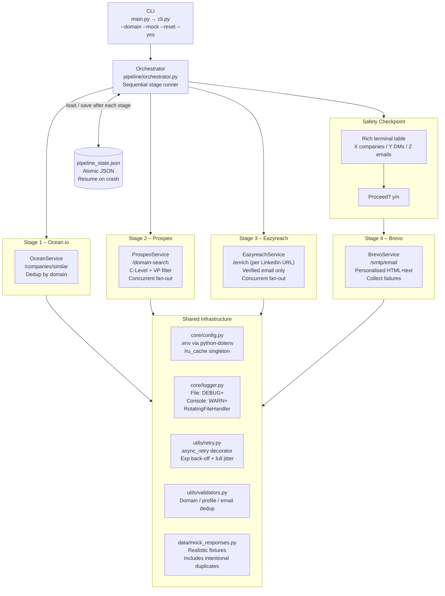

# Cold Outreach Pipeline

A fully automated B2B outreach pipeline that turns a single company domain into personalised, sent emails — with zero manual steps between stages.

```
python main.py --domain stripe.com --mock
```

---

## Architecture Diagram



---

## Project Structure

```
outreach_pipeline/
├── main.py                    # Entry point (5 lines)
├── cli.py                     # Arg parsing + rich terminal output
├── requirements.txt
├── .env.example               # Copy to .env and fill credentials
│
├── pipeline/
│   ├── __init__.py
│   └── orchestrator.py        # 4-stage coordinator + confirmation UI
│
├── services/
│   ├── base.py                # Shared aiohttp session + _get/_post helpers
│   ├── ocean.py               # Stage 1: similar company discovery
│   ├── prospeo.py             # Stage 2: decision maker enrichment
│   ├── eazyreach.py           # Stage 3: LinkedIn → verified email
│   └── brevo.py               # Stage 4: transactional email send
│
├── models/
│   └── schemas.py             # Pydantic contracts between every stage
│
├── core/
│   ├── config.py              # Centralised config, loaded once via lru_cache
│   ├── logger.py              # File + console logging
│   └── state.py               # Atomic load/save/reset of pipeline_state.json
│
├── utils/
│   ├── retry.py               # async_retry decorator (exp back-off + jitter)
│   └── validators.py          # Dedup helpers for domains, profiles, emails
│
├── data/
│   └── mock_responses.py      # Static fixtures for --mock mode
│
├── logs/
│   └── pipeline.log           # Created at runtime
│
└── tests/
    ├── test_validators.py
    ├── test_retry.py
    ├── test_brevo_template.py
    └── test_orchestrator.py
```

---

## Setup

### 1. Prerequisites

- Python 3.11 or newer
- API accounts for Ocean.io, Prospeo, Eazyreach, and Brevo (not needed for `--mock`)

### 2. Install dependencies

```bash
# Create and activate a virtual environment (recommended)
python -m venv .venv
source .venv/bin/activate        # Linux/macOS
.venv\Scripts\activate           # Windows

pip install -r requirements.txt
```

### 3. Configure environment variables

```bash
cp .env.example .env
# Open .env and replace placeholder values with your real API keys
```

---

## Running the Pipeline

### Mock mode — safe testing, zero API credits

```bash
python main.py --domain stripe.com --mock
```

Runs all four stages using `data/mock_responses.py`. The confirmation prompt still appears; type `y` to simulate sending.

### Live mode — real API calls

```bash
python main.py --domain stripe.com
```

Requires all four API keys in `.env`.

### Skip confirmation (CI / automation)

```bash
python main.py --domain stripe.com --mock --yes
```

### Reset cached state and start fresh

```bash
python main.py --domain stripe.com --reset
```

### Full help

```bash
python main.py --help
```

---

## Resume Behaviour

`pipeline_state.json` is written atomically (temp-file-then-rename) after every stage completes. If the process crashes mid-run:

```
Stage 1 ✓  (saved)
Stage 2 ✓  (saved)
Stage 3 ✗  CRASH
```

Re-running the same command resumes from Stage 3 automatically — Stages 1 and 2 are skipped with a `↩ cached` indicator.

The state file is keyed by `seed_domain`. Running with a different domain auto-detects the mismatch and starts fresh.

---

## Logs

```
logs/pipeline.log   — DEBUG-level, rotating at 5 MB, 3 backups
terminal            — WARNING and above only (rich handles INFO-level UX)
```

---

## API Notes & Assumptions

Each service class documents its endpoint assumptions with `# TODO: Verify endpoint` comments. Every base URL is overridable via `.env` without code changes.

| Service | Auth header | Assumed endpoint | Notes |
|---------|-------------|-----------------|-------|
| Ocean.io | `Authorization: Bearer` | `POST /companies/similar` | Response key: `companies[]` |
| Prospeo | `X-KEY` | `POST /domain-search` | Seniority filter: `c_suite`, `vp` |
| Eazyreach | `Authorization: Bearer` | `POST /enrich` | One call per LinkedIn URL |
| Brevo | `api-key` | `POST /smtp/email` | Confirmed from public docs |

---

## Design Decisions & Tradeoffs

### State machine over a database
State is a single JSON file rather than SQLite or Redis. This eliminates infrastructure dependencies, makes the state human-readable and debuggable with any text editor, and is trivially sufficient for a pipeline that processes one domain at a time. Tradeoff: not suitable for concurrent multi-domain runs (would need a keyed store).

### Atomic writes
`save_state` writes to a `tempfile` then calls `os.replace()` (POSIX atomic rename). This means a crash during a write leaves the previous valid state on disk — the file is never partially overwritten.

### Async fan-out with bounded concurrency
Stages 2, 3, and 4 process multiple items concurrently using `asyncio.gather` + `asyncio.Semaphore`. The semaphore limit (`CONCURRENT_REQUESTS=5`) prevents triggering 429 rate-limit responses. A failure on any single item (caught inside the service class) does not cancel the gather; the error is logged and the result is omitted.

### Retry decorator with full jitter
`utils/retry.py` implements the AWS "full jitter" strategy: `sleep = random(0, min(cap, base × 2^attempt))`. Full jitter outperforms equal jitter and decorrelated jitter when many clients retry simultaneously (thundering herd on 429s). `max_delay=60s` prevents unbounded sleep.

### Mock twins, not flags
Each service has a `get_*_mock()` method rather than a single method with an `if mock` branch. This keeps the live code path clean and makes the mock easily testable in isolation.

### Email body as a pure function
`brevo.py._build_email_body()` is a pure function: takes a `VerifiedContact`, returns `(subject, html, plaintext)`. No side effects, trivially unit-testable, and swappable for a Jinja2 template without touching the HTTP layer.

### Pydantic v2 strict validation
Every inter-stage data transfer uses a Pydantic model. Field validators normalise domains (strips `https://`, trailing slashes), lower-case emails, and auto-split full names into first/last. This means upstream API inconsistencies are caught and corrected at the boundary rather than propagating silently.

### Deduplication strategy
- **Domains** (Stage 1): Set of normalised lowercase strings.
- **Decision makers** (Stage 2): `(domain, normalised_full_name)` tuple set. Entries without a LinkedIn URL are dropped here — they are unusable by Stage 3.
- **Emails** (Stage 3): Set of lowercase email strings across all contacts.

### Error isolation
Per-record errors never abort the whole stage. `_get_for_domain` (Prospeo), `_enrich_one` (Eazyreach), and `_send_one` (Brevo) each catch all exceptions internally, log at ERROR level, and return an empty result or `None`. The orchestrator only receives the successful subset.

---

## Running Tests

```bash
pytest tests/ -v
```

Tests cover: deduplication logic, retry back-off timing, email template generation, and orchestrator resume logic (with mocked services).

---


# Known Limitations

- Ocean.io onboarding issues prevented reliable API access.
- Apollo Free plan restricts Company Search API endpoints.
- The architecture supports provider replacement through the Stage 1 service abstraction.
- Mock mode demonstrates the full end-to-end workflow without consuming paid API credits.


---


## Interview Quick Reference

**"How does resume work?"**
Each stage sets a boolean flag (`stage1_complete`) and saves the full Pydantic model to JSON atomically. On restart, `load_state` checks the domain matches, then the orchestrator checks each flag and skips completed stages.

**"How do you handle rate limits?"**
Two layers: (1) `asyncio.Semaphore` limits concurrent outbound requests globally; (2) `async_retry` with full-jitter exponential back-off retries on `aiohttp.ClientError` and `asyncio.TimeoutError`, which covers 429s and transient failures.

**"How do you prevent duplicate emails being sent?"**
Three dedup checkpoints: after Stage 1 (domain set), after Stage 2 (domain+name tuple set, also drops entries without LinkedIn), after Stage 3 (email address set). By the time Brevo sends, every address is guaranteed unique.

**"What's the mock flag for?"**
Zero API credits. All four services have a `*_mock()` method that returns data from `data/mock_responses.py`. The mock data includes intentional duplicates to verify the dedup logic runs correctly even in test mode.

**"How would you scale this?"**
Replace the JSON state file with Redis (keyed by domain); replace the semaphore with a proper task queue (Celery, ARQ); add a `--domains-file` flag for bulk input; move the email template to Jinja2 with a template registry. The service layer is already stateless and async — it scales horizontally without changes.